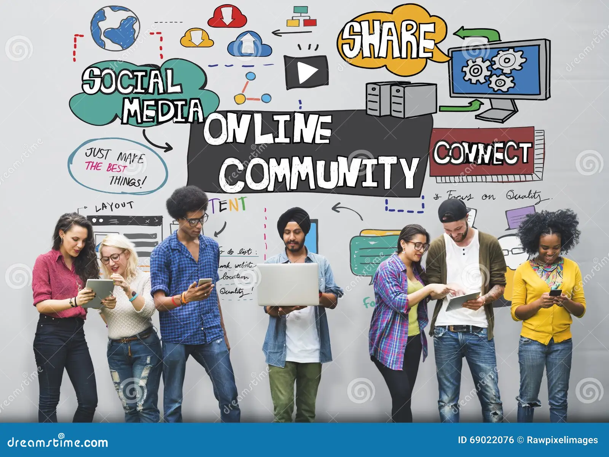

# Akademi (Flatiron School) — Data Science & AI, Cohorte 2025  

**Fourth Project** – Phase 4   
**Student Name**: Micka LOUIS      
**Student Pace**: Self-paced    
**Submission Deadline**: September 28, 2025      
**Instructors' Names**: Wedter JEROME & Geovany Batista Polo LAGUERRE    
**Blog Post URL**:  https://github.com/Micka-Louis/ds-project-phase-4.git

# Project Title  
## Measuring Public Perception of Apple and Google on Twitter with Machine Learning

# Overview
In today’s tech landscape, public sentiment significantly influences the strategies and brand perception of industry leaders like Apple and Google. This project analyzes Twitter data to understand how users express their opinions about these companies and their products. Both Apple and Google have a massive global footprint, with business performance and public perception closely tied to product launches and technological developments. For instance, Apple generated over 300 billion USD in revenue last year, while Alphabet, Google’s parent company, reported revenues exceeding 181 billion USD. By analyzing and interpreting public sentiment on social media, this study aims to provide actionable insights that can guide marketing decisions, product improvements, and overall brand strategy.  

# Business Understanding & Business Problem

**Business Understanding**  
Public sentiment on social media is a critical factor for technology companies like Apple and Google. Understanding how users perceive products and services can influence marketing strategies, product development, and overall brand reputation. Positive sentiment can drive sales and brand loyalty, while negative sentiment may highlight areas for improvement or potential risks to the brand image.

**Business Problem**  
Both Apple and Google face an important strategic question:  
➡️ Can we analyze Twitter data to identify how customers feel about their products and detect trends in sentiment over time?

An effective sentiment analysis model will allow the business to:  
- Monitor public perception of specific products in real time.  
- Identify areas of concern or potential product improvements based on negative sentiment.  
- Inform marketing campaigns and communication strategies to strengthen brand loyalty.  
- Support data-driven decision making in product launches and customer engagement initiatives.

# Data Understanding  
The dataset used for this project consists of over 9,000 tweets mentioning Apple and Google products. Each tweet has been labeled by human annotators to indicate the sentiment expressed towards a brand or product. The labels include:

- **Positive emotion**: The tweet expresses a positive opinion or satisfaction with the product.  
- **Negative emotion**: The tweet expresses dissatisfaction or criticism.  
- **Neutral / No emotion**: The tweet does not express a clear positive or negative sentiment.

The dataset includes the following key columns:

- `tweet_text`: The full text content of the tweet, which serves as the main explanatory feature for sentiment analysis.  
- `emotion_in_tweet_is_directed_at`: The specific brand or product referenced in the tweet (e.g., iPhone, iPad, Google).  
- `is_there_an_emotion_directed_at_a_brand_or_product`: The sentiment label assigned to the tweet (Positive, Negative, Neutral).

This dataset is well-suited for the business problem because it provides real user feedback on social media, capturing opinions in a natural and unstructured format. By analyzing this data, we can identify trends in public sentiment, detect product-specific issues, and derive actionable insights for Apple and Google marketing and product strategies.

| Feature | Description |
|----------|--------------|
| `tweet_text` | Content of the tweet |
| `company` | Apple or Google |
| `hashtags`, `mentions`, `urls` | Count of tweet metadata |
| `tweet_length` | Total number of characters |
| `sentiment` | Target label (negative, neutral, positive) |

                             
## Stakeholder / Audience  
The primary stakeholders for this project are the marketing, product, and customer experience teams at Apple and Google. These teams are responsible for:

- Monitoring public perception of their products and services.
- Identifying areas for improvement based on customer feedback.
- Designing marketing campaigns that resonate with users.
- Making data-driven decisions for product development and brand strategy.

The audience for this analysis includes both technical and non-technical team members:

- **Technical audience**: Data analysts and data scientists who will use the model outputs to explore deeper insights, run additional analyses, or integrate the results into dashboards.
- **Non-technical audience**: Marketing managers, product managers, and executives who require clear, actionable insights to inform strategic decisions without needing to understand the underlying algorithms.

By targeting both audiences, the project ensures that the insights derived from Twitter sentiment analysis are both actionable and understandable, supporting better decision-making across the organization.

# Data Cleaning
**Key Steps**

Dropped irrelevant columns (emotion_in_tweet_is_directed_at)

Handled missing values — dropped rows or filled placeholders

Renamed and standardized columns — is_there_an_emotion_directed_at_a_brand_or_product → sentiment

Cleaned text — lowercasing, removing punctuation, URLs, numbers, and extra spaces

Removed stopwords and lemmatized tokens

Vectorized text using TF-IDF and Bag of Words  
+------------------+       +-----------------+       +------------------+       +------------------+       +----------------+
| Data Collection  | --->  | Data Cleaning   | --->  | Feature Extraction| --->  | Model Training   | --->  | Evaluation     |
| (Tweets)         |       | (Preprocessing) |       | (TF-IDF + Numeric)|       | (ML Algorithms)  |       | (Metrics & Viz)|
+------------------+       +-----------------+       +------------------+       +------------------+       +----------------+

 # Modeling Phase  
**Models Used**  

We trained and evaluated four supervised learning models using pipelines and hyperparameter tuning:

Logistic Regression

Random Forest

Support Vector Machine (Linear)

XGBoost

Each model was tested under:

Multiclass classification (Negative / Neutral / Positive)

Binary classification (Negative vs Positive)

 ## Multiclass Sentiment Classification
**Performance Metrics**
| Model               | Accuracy | Macro F1 | Strengths                     | Weaknesses                    |
| ------------------- | -------- | -------- | ----------------------------- | ----------------------------- |
| Logistic Regression | 0.6611   | 0.5801   | Balanced across classes       | Limited for minority class    |
| Random Forest       | 0.6773   | 0.5168   | High accuracy; neutral strong | Poor minority recall          |
| SVM (Linear)        | 0.6577   | 0.5795   | Best macro F1                 | Slightly lower accuracy       |
| XGBoost             | 0.6806   | 0.4757   | Highest accuracy              | Weak minority class detection |

📈 **Interpretation**  
Neutral sentiment easiest to predict

Negative/Positive harder due to class imbalance

Macro F1 more informative than accuracy

Logistic Regression and SVM better handle class balance  

## Binary Sentiment Classification
**Performance Metrics**  
| Model               | Accuracy | Macro F1 | Strengths                     | Weaknesses                  |
| ------------------- | -------- | -------- | ----------------------------- | --------------------------- |
| Logistic Regression | 0.8296   | 0.7330   | Balanced and robust           | Slightly lower accuracy     |
| Random Forest       | 0.8690   | 0.6513   | Highest accuracy              | Weaker minority recall      |
| SVM (Linear)        | 0.8239   | 0.7150   | Good precision/recall balance | Slightly less accurate      |
| XGBoost             | 0.8620   | 0.6549   | Strong ensemble               | Lower F1 for minority class |

**Insights**  
Removing neutral improved model clarity

Logistic Regression achieved best macro F1

Ensemble models achieved top accuracy

Binary classification performed better overall  

### Feature Importance

TF-IDF textual features dominate sentiment prediction.

Numeric features (tweet length, hashtags, mentions, URLs) add meaningful context.

Combined features → best predictive performance.  

# Conclusion
This project aimed to analyze public sentiment on Apple and Google products on Twitter, using both multiclass (negative, neutral, positive) and binary (negative vs positive) sentiment classification approaches. Several machine learning models were evaluated, including Logistic Regression, Random Forest, SVM, and XGBoost, combining textual (TF-IDF) and numeric features.

**Key Findings**
Multiclass Classification

Accuracy ranged between 65% and 68%, with Logistic Regression and SVM providing the most balanced performance (higher macro F1).
Neutral sentiment was consistently easiest to predict, while negative and positive sentiments were challenging due to class imbalance.
Ensemble models (Random Forest and XGBoost) achieved higher accuracy but struggled with minority classes.  
Binary Classification

Focusing on negative vs positive improved model performance significantly.
Accuracy ranged from ~82% to 87%, with Logistic Regression achieving the best macro F1, indicating good balance between precision and recall for both classes.
Removing the neutral class reduced confusion and enhanced the detection of minority class sentiment.  
**Feature Importance**

Textual features (TF-IDF) played a key role in sentiment prediction.
Numeric features such as tweet length, number of hashtags, mentions, exclamations, and URLs contributed additional predictive power.
The project demonstrates that combining textual and numeric features with machine learning models can effectively capture public sentiment on social media. While multiclass sentiment classification remains challenging due to class imbalance, binary sentiment classification yields strong performance and actionable insights. This analysis empowers businesses, investors, and consumers to make data-driven decisions based on public opinion.

# Business Recommendations
Based on the sentiment analysis of Apple and Google products on Twitter, the following recommendations are proposed for stakeholders:

## Recommendation 1 — Enhance Product Features Based on Customer Sentiment  
Focus on addressing negative feedback highlighted in tweets, particularly around commonly mentioned issues in both Apple and Google products.
Prioritize improvements in features that frequently generate negative sentiment to increase overall customer satisfaction and reduce public criticism.
Monitor sentiment trends over time to evaluate the impact of product updates or feature releases.

## Recommendation 2 — Optimize Marketing Campaigns  
Leverage positive sentiment trends to design campaigns that highlight features users love.
Tailor messaging to address neutral or slightly negative sentiments, converting potential critics into satisfied users.
Use sentiment insights to segment the audience for targeted campaigns that resonate with different user groups.  

## Recommendation 3 — Inform Strategic Decision-Making 
Incorporate sentiment metrics into product development and brand strategy planning.
Use predictive insights from the binary and multiclass models to anticipate public reactions to upcoming launches or updates.
Regularly report key sentiment KPIs (accuracy, macro F1, positive/negative ratios) to executives for data-driven decisions.  

# Next Steps
**Class Imbalance Handling**

Implement techniques such as oversampling, undersampling, or SMOTE to improve minority class prediction in multiclass sentiment analysis.
Re-evaluate model performance after balancing classes.
Feature Expansion

Incorporate additional features from tweets, such as emojis, sentiment lexicons, or engagement metrics (likes, retweets) to improve model accuracy.
Test advanced text embeddings (e.g., BERT, RoBERTa) for richer semantic understanding.
Continuous Monitoring & Automation

Set up an automated pipeline to collect and preprocess tweets daily or weekly.
Continuously update models and dashboards to reflect real-time sentiment trends.
Visualization & Reporting

Develop interactive dashboards for both technical and non-technical stakeholders.
Include visualizations for positive, neutral, and negative sentiment distribution, trends over time, and key influencing factors.
Actionable Insights Integration

Align insights with marketing and product roadmaps.
Create alerts for sudden spikes in negative sentiment to enable rapid response.
Overall:
By following these recommendations and next steps, Apple and Google can proactively manage public perception, improve customer satisfaction, and make data-driven decisions that align product development and marketing strategies with real-time user sentiment.  

# Author

Micka LOUIS  
🎓 Akademi- Data Science & AI    
🎓 CTPEA — Economics & Statistics  
📅 2025  
📧 mickalouis25@gmail.com  

# Repository Structure  
├── data  
├── images  
├── Final.ipynb  
├── Final.pdf  
├── LICENSE  
├── Presentation.pdf  
└── README.md   

